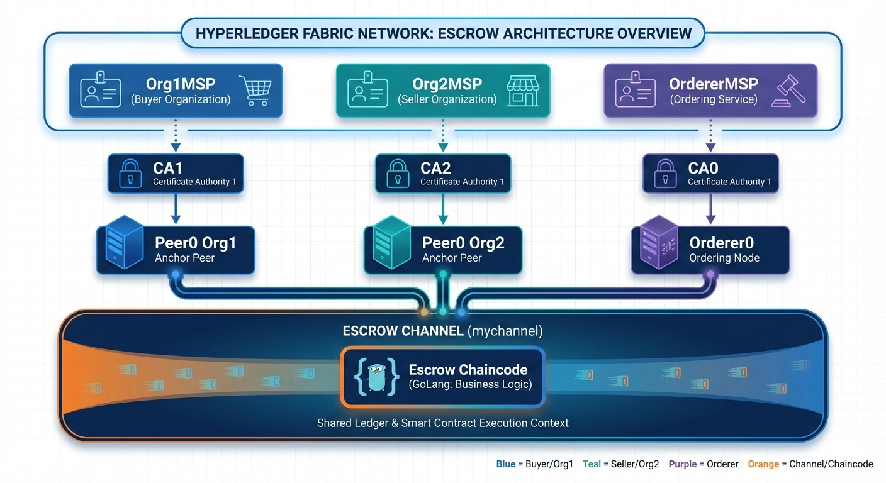

# Hyperledger Fabric Prototype for Real Estate Transaction Registration and Traceability

## 🔹 Project Overview

This project is a **complete migration** from an Ethereum-based escrow system to **Hyperledger Fabric**.

The escrow system enables secure transactions between Buyers and Sellers using blockchain technology to lock funds until delivery confirmation.


##  Architecture Overview

### Network Components



 


## Ethereum → Hyperledger Fabric Mapping

| **Ethereum Concept**              | **Hyperledger Fabric Equivalent**           | **Explanation**                                                                 |
|-----------------------------------|---------------------------------------------|---------------------------------------------------------------------------------|
| **Smart Contract (Solidity)**     | **Chaincode (Go)**                          | Business logic implementation                                                   |
| **Ethereum Account**              | **MSP Identity (X.509 Certificate)**        | User identity managed by Certificate Authority                                  |
| **PoA Clique Validator**          | **Endorsing Peers + Orderer**               | Consensus through endorsement policy + ordering service                         |
| **msg.sender**                    | **GetCreator() / ClientIdentity**           | Retrieve transaction initiator's identity                                       |
| **msg.value (ETH)**               | **Chaincode State (off-chain settlement)**  | Fabric doesn't handle native cryptocurrency; funds tracked in world state      |
| **Events (emit)**                 | **SetEvent()**                              | Chaincode events for client notification                                        |
| **mapping(key => value)**         | **PutState() / GetState()**                 | Key-value storage in world state database (CouchDB/LevelDB)                    |
| **require(condition)**            | **return shim.Error()**                     | Input validation and error handling                                             |
| **Public/Private functions**      | **Exported/Unexported Go functions**        | Capital letter = exported (public), lowercase = unexported (private)           |
| **Contract deployment**           | **Chaincode installation + instantiation**  | Install on peers, instantiate on channel                                        |
| **Web3.js**                       | **Fabric SDK (Node.js/Go)**                 | Client application interaction with network                                     |
| **Transaction confirmation**      | **Endorsement + Ordering + Validation**     | Multi-step transaction lifecycle in Fabric                                      |
| **Gas fees**                      | **No transaction fees**                     | Fabric has no native token; no gas concept                                      |

---

##  Business Logic Preservation

### Escrow Workflow

1. **Create Escrow** → Seller creates escrow transaction with property details
2. **Deposit Funds** → Buyer deposits funds (tracked in chaincode state)
3. **Deliver Product** → Seller delivers property outside blockchain
4. **Confirm Delivery** → Buyer confirms reception
5. **Release Funds** → Funds are marked as released to seller
6. **Close Escrow** → Escrow is marked as closed

### Security Rules

-  Funds locked until buyer confirmation
-  Seller cannot withdraw before confirmation
-  Escrow can be cancelled (funds returned to buyer)
-  Transaction integrity ensured through endorsement policy


##  Project Structure

```
fabric-escrow-network/
├── README.md                          # This file
├── DEPLOYMENT.md                      # Step-by-step deployment guide
├── ARCHITECTURE.md                    # Detailed architecture explanation
│
├── network/                           # Fabric network configuration
│   ├── configtx/
│   │   └── configtx.yaml             # Channel & genesis block config
│   ├── crypto-config/
│   │   └── crypto-config.yaml        # CA & certificate configuration
│   ├── docker/
│   │   ├── docker-compose-ca.yaml    # Certificate Authorities
│   │   ├── docker-compose-net.yaml   # Peers & Orderer
│   │   └── docker-compose-cli.yaml   # CLI tools
│   └── scripts/
│       ├── generate-crypto.sh        # Generate certificates
│       ├── generate-genesis.sh       # Generate genesis block
│       ├── create-channel.sh         # Create channel
│       ├── join-channel.sh           # Join peers to channel
│       └── deploy-chaincode.sh       # Deploy chaincode
│
├── chaincode/                        # Smart contract implementation
│   └── escrow/
│       ├── main.go                   # Chaincode entry point
│       ├── escrow.go                 # Core escrow logic
│       ├── models.go                 # Data structures
│       └── go.mod                    # Go dependencies
│
├── client/                           # Client applications
│   ├── go-client/
│   │   ├── main.go                   # Go SDK client
│   │   ├── config.yaml               # Network connection profile
│   │   └── wallet/                   # User credentials
│   └── nodejs-client/
│       ├── index.js                  # Node.js SDK client
│       ├── package.json
│       └── wallet/
│
└── docs/                             # Additional documentation
    ├── Project_Report.md             # report
    └── TESTING.md                    # Testing guide
```


##  Quick Start

### Prerequisites

- Docker & Docker Compose
- Go 1.21+
- Node.js 18+ (for Node.js client)
- Hyperledger Fabric binaries (fabric-tools)

### 1. Clone & Setup

```bash
cd fabric-escrow-network
```

### 2. Generate Crypto Material

```bash
cd network/scripts
./generate-crypto.sh
./generate-genesis.sh
```

### 3. Start the Network

```bash
# Start Certificate Authorities
docker-compose -f network/docker/docker-compose-ca.yaml up -d

# Start Peers and Orderer
docker-compose -f network/docker/docker-compose-net.yaml up -d
```

### 4. Create Channel

```bash
./network/scripts/create-channel.sh
./network/scripts/join-channel.sh
```

### 5. Deploy Chaincode

```bash
./network/scripts/deploy-chaincode.sh
```

### 6. Run Client Application

```bash
# Go client
cd client/go-client
go run main.go

# OR Node.js client
cd client/nodejs-client
npm install
node index.js
```


##  Key Features

### Chaincode Functions

- `CreateEscrow` - Initialize new escrow transaction
- `DepositFunds` - Buyer deposits funds
- `ConfirmDelivery` - Buyer confirms delivery
- `ReleaseFunds` - Release funds to seller
- `CancelEscrow` - Cancel and refund buyer
- `QueryEscrow` - Get escrow details
- `GetEscrowHistory` - Get transaction history

### Security Features

-  MSP-based identity management
-  Endorsement policy (requires both Org1 & Org2 approval)
-  TLS encryption for peer communication
-  Certificate-based authentication
-  Private data collections (optional)


##  Documentation

- [DEPLOYMENT.md](./DEPLOYMENT.md) - Complete deployment guide
- [ARCHITECTURE.md](./ARCHITECTURE.md) - Detailed architecture explanation
- [API.md](./docs/API.md) - Chaincode API reference


##  Technology Stack

- **Blockchain Platform**: Hyperledger Fabric 2.5
- **Chaincode Language**: Go 1.21
- **Consensus**: Raft (Ordering Service)
- **State Database**: CouchDB (supports rich queries)
- **Client SDK**: Fabric SDK Go / Fabric SDK Node.js
- **Certificate Authority**: Fabric CA
- **Container Platform**: Docker


##  prepared by

**Hanane OUDAALI**

**Saida ALABA**


**Note**: This project preserves the original Ethereum escrow business logic while leveraging Hyperledger Fabric's enterprise-grade features including permissioned network, modular architecture, and high throughput.
